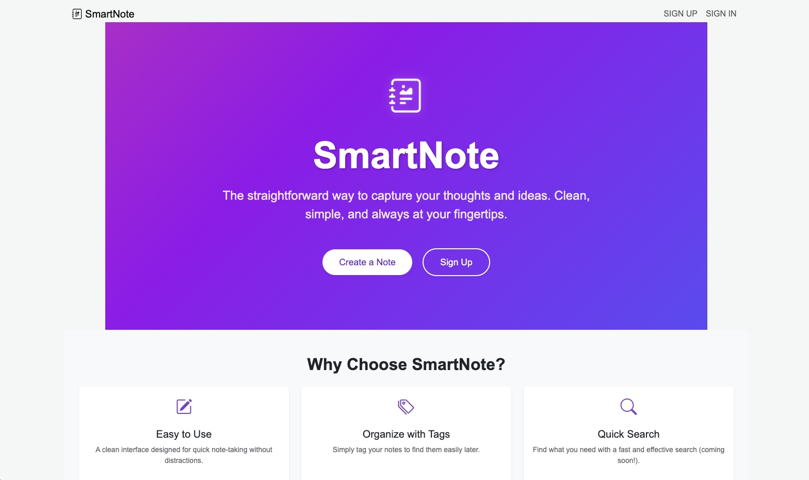
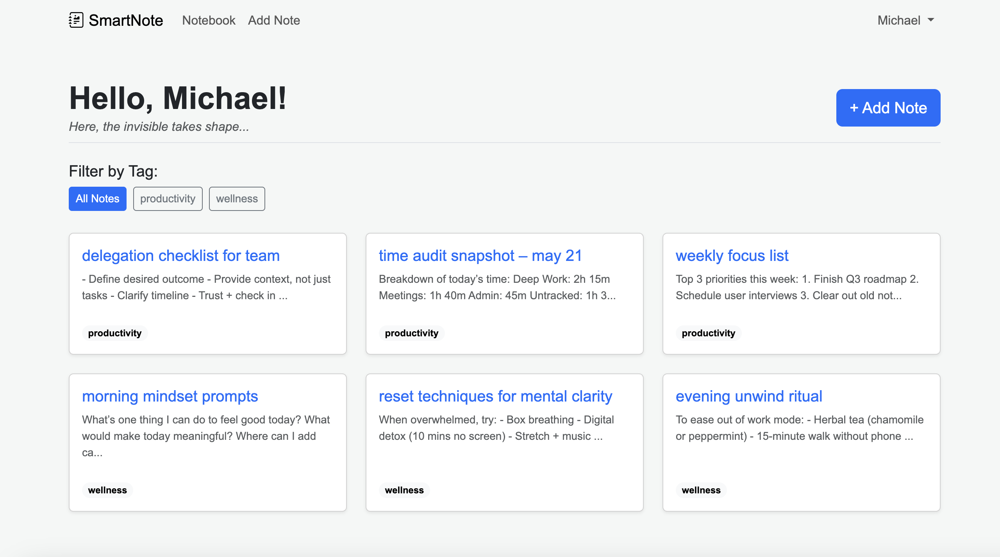

# SmartNote



## Description

SmartNote is a clean and intuitive note-taking application designed to help you capture and organize your thoughts effortlessly. Built with simplicity in mind, SmartNote provides a distraction-free environment where you can focus on what matters most – your ideas.

The app was created to address the need for a straightforward note-taking solution that doesn't overwhelm users with unnecessary features. Whether you're jotting down quick thoughts, planning projects, or organizing your daily tasks, SmartNote keeps everything simple and accessible.



## Features

- **Clean Interface**: A clutter-free design that lets you focus on writing
- **Tag Organization**: Organize your notes with tags for easy categorization and filtering
- **User Authentication**: Secure sign-up and sign-in functionality
- **Responsive Design**: Works seamlessly across desktop and mobile devices
- **Real-time Updates**: Your notes are automatically saved and updated

## Getting Started

### Live Application
Access SmartNote here: [SmartNote on Heroku](https://smartnote-8f2c2a78ab90.herokuapp.com/)

### Planning Materials
View the project planning and future enhancements on our [Trello Board](https://trello.com/b/ZTMUEySL/project-2v0)

### Local Development

1. Clone the repository
2. Install dependencies:
   ```bash
   npm install
   ```
3. Set up environment variables:
   - Create a `.env` file in the root directory
   - Add your MongoDB connection string and session secret
4. Start the development server:
   ```bash
   node server.js
   ```

## Technologies Used

- **Backend**: Node.js, Express.js
- **Database**: MongoDB with Mongoose ODM
- **Authentication**: bcrypt for password hashing, express-session for session management
- **Frontend**: EJS templating engine, Bootstrap 5
- **Styling**: Custom CSS with Bootstrap Icons
- **Favicon Generation**: RealFaviconGenerator.net 
- **Middleware**: method-override, morgan for logging
- **Deployment**: Heroku

## Next Steps

Our roadmap includes several exciting enhancements planned for future releases:

- **Search Functionality**: Implement full-text search across all notes
- **Rich Text Editor**: Add formatting options for better note presentation
- **Export Options**: Allow users to export notes in various formats (PDF, Markdown, etc.)
- **Collaboration Features**: Share notes with other users
- **Dark Mode**: Implement a dark theme option
- **Mobile App**: Develop native mobile applications
- **Backup & Sync**: Cloud backup and synchronization across devices
- **AI Review**: Add high-level review from AI to enhance note content
- **Speak-to-Listen**: Add speak-to-listen capability to new notes
- **Note Templates**: Pre-defined templates for common note types

For detailed progress tracking and additional feature requests, visit our [Trello Board](https://trello.com/b/ZTMUEySL/project-2v0).

## Contributing

This is a personal project, but feedback and suggestions are always welcome! Feel free to open an issue or reach out with your thoughts.

## License

This project is open source and available under the [MIT License](LICENSE).